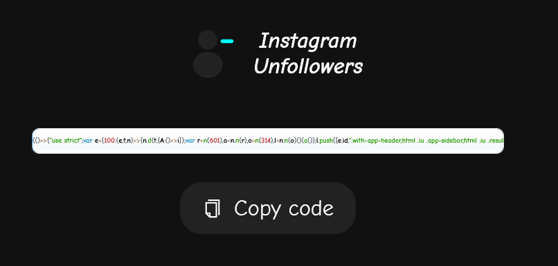
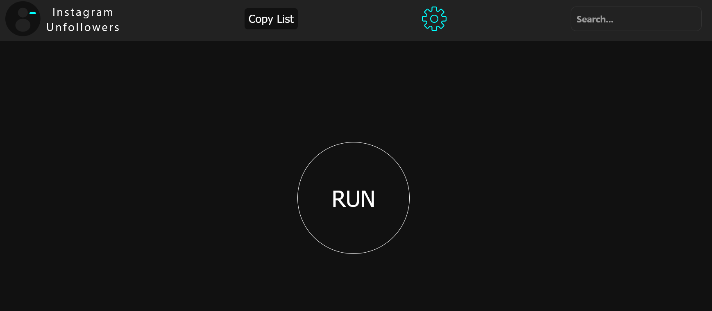
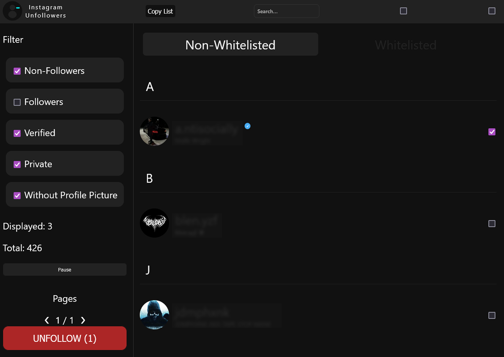
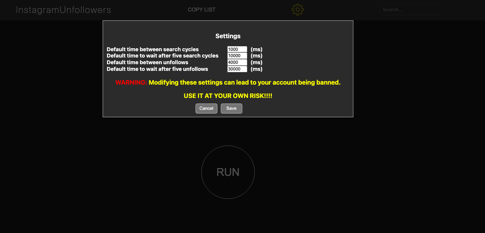

# 📱 Phần mềm Hyu's Check Instagram Unfollowers -- v 0.1 Beta

Một công cụ tiện lợi cho phép bạn xem ai không follow lại bạn trên Instagram.  
<u>Chạy trên trình duyệt, không cần tải hay cài đặt gì cả!</u>

## ⚠️ WARNING

Phiên bản này dùng API của Instagram nên hiệu quả hơn. Vì là sử dụng API nên bạn không cần phải cung cấp mật khẩu hay gì cả. Qua đó không sợ bị đánh cắp thông tin, cookie và token.   

## 🖥️ Desktop Usage

1. Copy the code from: [Docs của Huy](https://docs.google.com/document/d/1VDtMoQVkZRm30Bs1r9D54YrJHlyNPcp5V4rCSKTPjgY/edit?usp=sharing)

2. Ctril A Ctril C đoạn code

    

3. Đăng nhập IG trên trình duyệt

4. Mở Dev Console:
   - Windows: `Ctrl + Shift + J`
   - Mac OS: `⌘ + ⌥ + I`

5. Ctril V Enter và bạn sẽ thấy cái này:

    

6. Bấm "RUN"

7. Sau khi quét xong, bạn sẽ thấy kết quả:

    

8. 🤍 **Thêm người dùng vào danh sách trắng** bằng cách nhấn vào ảnh đại diện của họ.

9. ✅ **Chọn người dùng để hủy theo dõi** bằng cách dùng các ô đánh dấu.

10. ⚙️ **Tùy chỉnh thời gian chạy của script** qua nút "Cài đặt".

    

## 📱 **Dùng trên điện thoại**

Nếu bạn dùng Android và muốn sử dụng công cụ này trên điện thoại:

1. Tải phiên bản mới nhất của **[Eruda Android Browser](https://github.com/liriliri/eruda-android/releases/)**.
2. Mở Instagram phiên bản web bằng trình duyệt Eruda.
3. Thực hiện các bước tương tự như trên máy tính (biểu tượng Eruda sẽ tự động hiện ra khi bạn bấm vào biểu tượng Eruda).

---

## ⚡ **Lưu ý về hiệu suất**

- Thời gian xử lý sẽ tăng lên tùy thuộc vào số lượng người dùng bạn muốn kiểm tra.
- Script hoạt động tốt trên cả trình duyệt nền Chromium và Firefox.
- Script sẽ mất thêm vài giây để tải trên điện thoại.